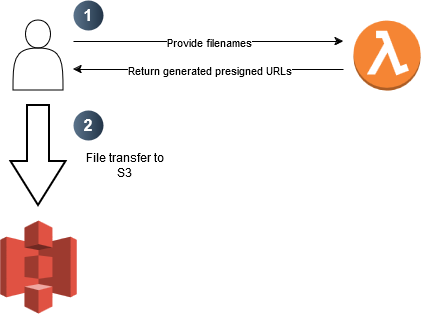

# Harena & Rohith wedding site

This is the official website for my sister's wedding! Visit it at https://rhwedding.photos.

The site consists of a way to share photos with the bride and groom, and a timeline and explanation of the Hindu ceremonies.

## Architecture



## Local development

This site is made with Vite + React + TypeScript. You can clone this repository and run the following:

```
npm install
npm run dev
```